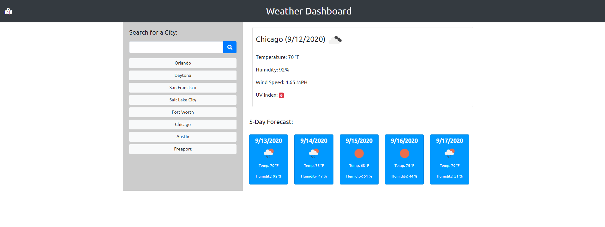

# Questions Game

[Go To Site](https://daysloth.github.io/WeatherApp/)

## Description 

A very simple weather searching application. You can input a city name, it will call out to a weather api and get back the selected values to display on the webpage. It will also give you a 5 day forecast, and the option to select a previously searched city's current weather.

## Testing

Input a city name and submit the input. It will then search and display the results. The previously searched city buttons should appear and you can select one of those to check the weather again. I have also added a current location icon at the top left where you can get your current location's weather data as well.

## Unique Feature

I feel a unique feature added to this project is the default behavior if nothing is previsouly searched. It will try to grab a prevously searched item and if none exist it will grab your location and display your current locations weather data. I also added in an icon to do the same in the navbar.

## Credits

Credits go to W3 schools for clearing up any JavaScript questions I had

## License

Copyright (c) Allister Rampenthal. All rights reserved.

Licensed under the [MIT](https://choosealicense.com/licenses/mit/) license
